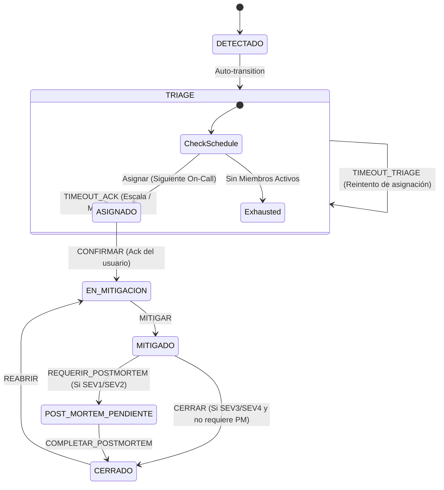

# Motor de Gestión de Incidentes On-Call (mini PagerDuty)

Este proyecto es una aplicación backend monolítica basada en **Spring Boot** y **Spring State Machine (SSM)** que gestiona el ciclo de vida de incidentes técnicos bajo un esquema de guardias rotativas (*on-call*). Cuenta con renderizado del lado del servidor (SSR) mediante Thymeleaf y una interfaz premium adaptada a modo oscuro.

El núcleo de la solución es la automatización del escalamiento: **si una persona no confirma (ACK) un incidente asignado dentro del tiempo límite, el sistema lo escala al siguiente miembro activo de la guardia de forma circular e ininterrumpida**.

---

## 🛠️ Stack Tecnológico

*   **Lenguaje:** Java 23
*   **Framework Principal:** Spring Boot 3.3.1
*   **Motor de Estados:** Spring State Machine (SSM) 4.0.2 (Jakarta EE baseline)
*   **Persistencia:** Spring Data JPA + Hibernate
*   **Base de Datos:** H2 Database (modo de almacenamiento en archivo local persistente)
*   **Seguridad:** Spring Security (autenticación en memoria con BCrypt)
*   **Capa de Presentación:** Spring MVC + Thymeleaf + Vainilla CSS + Javascript (para timers en vivo)

---

## 🚀 Funcionalidades Principales

1.  **Ciclo de Vida Controlado por State Machine**: El ciclo del incidente transiciona estrictamente a través de eventos controlados (`CREAR`, `ASIGNAR`, `CONFIRMAR (ACK)`, `MITIGAR`, `CERRAR`, `REABRIR`).
2.  **Escalamiento Automático y Resiliente (DB-Backed Timers)**: En lugar de depender de temporizadores en memoria que se pierden con un reinicio, el sistema persiste la marca de tiempo `timeoutAt` en la base de datos y un planificador en segundo plano (`Spring Scheduler`) audita los incidentes activos cada 5 segundos para disparar los eventos de escalamiento (`TIMEOUT_ACK`).
3.  **Cadena de Guardia Rotativa**: Se definen cronogramas de guardia con ingenieros ordenados por prioridad. El motor busca recursivamente al siguiente miembro con estado `ACTIVE` para asignarle el incidente. Si todos los miembros de la guardia están inactivos, el incidente se marca con `escalation_exhausted = true` y alerta en rojo en la pantalla.
4.  **Bloqueo de Cierre por Post-Mortem**: Los incidentes graves (`SEV1` y `SEV2`) no permiten el cierre inmediato. La máquina de estados bloquea la transición y los desvía al estado `POST_MORTEM_PENDIENTE`, donde se exige documentar la causa raíz y plan de acción antes de archivar.
5.  **Dashboard Operativo (KPIs)**:
    *   **MTTA** (Mean Time to Acknowledge): Tiempo promedio entre la asignación y la confirmación del ingeniero.
    *   **MTTR** (Mean Time to Resolve): Tiempo promedio entre la creación del incidente y su mitigación.
    *   **Missed Acks Leaderboard**: Tabla de clasificación con las fallas de confirmación acumuladas por cada miembro de la guardia.

---

## 📊 Ciclo de Vida del Incidente (Máquina de Estados)



---

## 👥 Usuarios de Prueba y Credenciales

La plataforma cuenta con Spring Security configurado. Se puede ingresar con las siguientes credenciales en memoria:

| Usuario | Contraseña | Nombre Completo | Roles | Rol Operativo |
| :--- | :--- | :--- | :--- | :--- |
| `romina` | `admin123` | Romina Acosta | `ADMIN`, `USER` | Administrador General |
| `juan` | `user123` | Juan Pérez | `USER` | Ingeniero Backend (1° en Rotación) |
| `maria` | `user123` | María Gómez | `USER` | Ingeniero Backend (2° en Rotación) |
| `lucas` | `user123` | Lucas Díaz | `USER` | Ingeniero Backend (3° en Rotación) |

---

## 🏁 Guía de Inicio Rápido

### 1. Clonar y Abrir el Proyecto
Abre el directorio del proyecto en tu IDE preferido (ej., **IntelliJ IDEA** o **VS Code**). El IDE importará automáticamente el archivo `pom.xml` y descargará las dependencias de Maven.

### 2. Ejecutar la Aplicación
Puedes arrancar la aplicación desde la clase principal `OnCallEngineApplication` o mediante tu terminal usando Maven:
```bash
mvn spring-boot:run
```

La aplicación estará disponible en: [http://localhost:8080](http://localhost:8080)
La consola de administración H2 en: [http://localhost:8080/h2-console](http://localhost:8080/h2-console) (Credenciales JDBC: URL=`jdbc:h2:file:./data/oncalldb`, User=`sa`, Password= vacío).

### 3. Flujo de Prueba Recomendado
1.  Inicia sesión como `romina` (administrador) y accede al **Dashboard**.
2.  Ve a **Incidentes** -> **Reportar Incidente** y crea un reporte con severidad **SEV1** (Triage: 2 min / Ack: 1 min) asignado a la *"Guardia de Backend Primary"*.
3.  Al crearse, el motor buscará al primer ingeniero activo. En este caso asignará a `juan` y el incidente cambiará a estado `ASIGNADO` con un temporizador de cuenta regresiva en vivo de 1 minuto.
4.  **Si dejas pasar 1 minuto**:
    *   El programador de tareas en segundo plano (`TimeoutScheduler`) detectará que el tiempo expiró.
    *   Gatillará el evento `TIMEOUT_ACK` en el backend.
    *   Incrementará en +1 la métrica `missedAcksCount` de `juan`.
    *   Liberará la asignación y rotará la guardia a `maria` (segunda en la lista).
    *   La página se actualizará sola mostrando la nueva asignación.
5.  **Si quieres resolverlo**:
    *   Cierra sesión e ingresa como `maria`.
    *   Ve al incidente asignado y presiona **Confirmar Recepción (ACK)**. El incidente entrará en `EN_MITIGACION` y se detendrán los temporizadores de escalamiento.
    *   Una vez solucionada la falla, presiona **Marcar como Mitigado**.
    *   Al intentar presionar **Cerrar Incidente**, dado que es un incidente grave (SEV1), el sistema bloqueará la transición y presentará el **Formulario de Post-Mortem**.
    *   Completa el análisis de causa raíz y acciones correctivas. Al enviar, el incidente finalmente pasará a estado **CERRADO**.
