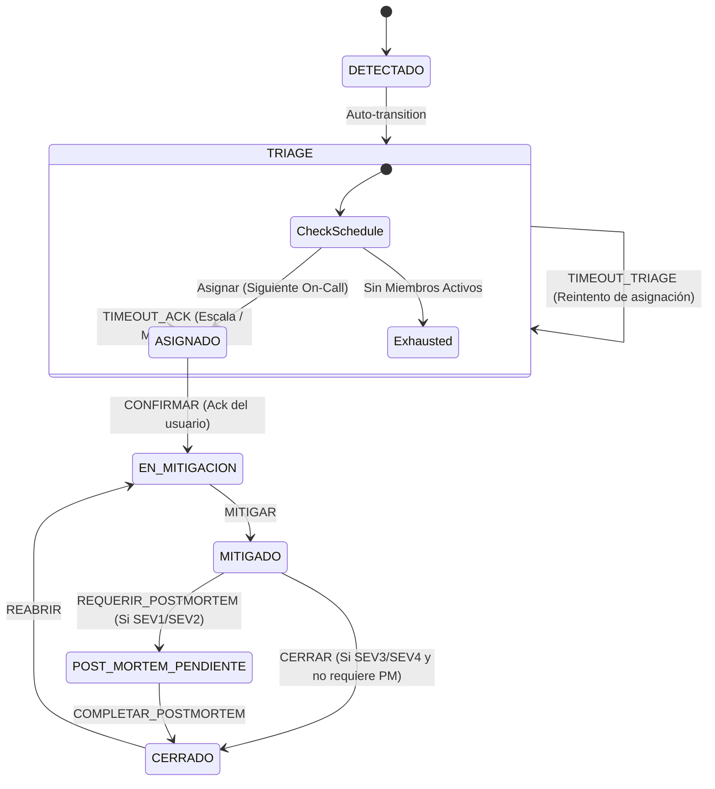
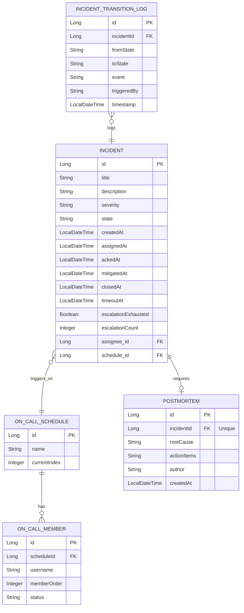

# Especificaciones Funcionales y Técnicas: Motor de Gestión de Incidentes On-Call (mini PagerDuty)

Este documento detalla las especificaciones técnicas y funcionales para el desarrollo del **Motor de Gestión de Incidentes On-Call** (mini PagerDuty). Está basado en el [RFC-001](file:///C:/Users/Noxie-PC/Documents/GestionDeIncidentes/RFC-incident-oncall-engine.md) y en las decisiones de diseño validadas para garantizar un sistema robusto, con persistencia ante reinicios y una interfaz de usuario web premium mediante Renderizado del Lado del Servidor (SSR).

---

## 1. Arquitectura y Stack Tecnológico

El sistema se construirá utilizando el framework **Spring Boot** con arquitectura monolítica SSR (Server-Side Rendering).

*   **Lenguaje:** Java 23
*   **Framework Principal:** Spring Boot 3.x
*   **Base de Datos:** H2 Database (en memoria/archivo para desarrollo rápido) con soporte opcional para PostgreSQL.
*   **Persistencia:** Spring Data JPA + Hibernate
*   **Motor de Estados:** Spring State Machine (SSM)
*   **Frontend (SSR):** Spring MVC + Thymeleaf + HTML5 + CSS3 (Vainilla con variables customizadas para modo oscuro y micro-animaciones).
*   **Seguridad:** Spring Security (Formulario de login simple y usuarios cargados en memoria).
*   **Planificador (Timers):** Spring Scheduler (`@Scheduled`) coordinado con marcas de tiempo en la base de datos para garantizar persistencia y resiliencia ante reinicios del servidor.

---

## 2. Especificación Funcional

### 2.1 Ciclo de Vida del Incidente (Máquina de Estados)

El núcleo del dominio está regido por una máquina de estados por incidente (State Machine per Aggregate).



#### Estados:
1.  **`DETECTADO`**: Estado inicial y transitorio. Se crea el incidente en la base de datos.
2.  **`TRIAGE`**: Estado en el cual el sistema está determinando el responsable o esperando asignación.
3.  **`ASIGNADO`**: El incidente tiene un responsable asignado (`currentAssignee`), pero este aún no ha confirmado la recepción (no hizo "Acknowledge").
4.  **`EN_MITIGACION`**: El responsable confirmó el incidente y se encuentra trabajando en la solución.
5.  **`MITIGADO`**: El impacto técnico o de negocio ha cesado. El incidente ya no está activo, pero requiere cierre formal.
6.  **`POST_MORTEM_PENDIENTE`**: Para incidentes graves (`SEV1` y `SEV2`), se bloquea el cierre hasta que se complete un informe de causa raíz.
7.  **`CERRADO`**: Estado final de archivo del incidente.

#### Eventos y Reglas de Negocio (Guards & Actions):
*   **`CREAR_INCIDENTE`**: Registra el incidente y transiciona a `TRIAGE`.
*   **`ASIGNAR`**:
    *   *Guard:* El usuario asignado debe ser un miembro activo (`status = ACTIVE`) en la guardia del cronograma asignado.
    *   *Action:* Asigna el `currentAssignee`, actualiza `assignedAt` y transiciona a `ASIGNADO`.
*   **`CONFIRMAR` (Acknowledge)**:
    *   *Guard:* Solo puede ser ejecutado por el `currentAssignee` o un administrador.
    *   *Action:* Transiciona a `EN_MITIGACION`, registra `ackedAt`, calcula el **MTTA** (`ackedAt - assignedAt`), y limpia el temporizador de expiración (`timeoutAt = null`).
*   **`TIMEOUT_ACK`**:
    *   *Disparador:* Automático por el planificador si el tiempo actual supera `timeoutAt` en estado `ASIGNADO`.
    *   *Action:*
        1.  Incrementa `missedAcksCount` del usuario asignado actual.
        2.  Registra un log especial de tipo "Missed Ack".
        3.  Incrementa el contador de escalamientos (`escalationCount`) en el incidente.
        4.  Libera el asignado actual (`currentAssignee = null`).
        5.  Avanza el `currentIndex` del cronograma de guardia (`OnCallSchedule`) al siguiente miembro.
        6.  Transiciona de regreso a `TRIAGE` para disparar una nueva asignación.
*   **`MITIGAR`**:
    *   *Action:* Transiciona a `MITIGADO`, registra `mitigatedAt`, calcula y guarda el **MTTR** (`mitigatedAt - createdAt`).
*   **`REQUERIR_POSTMORTEM`**:
    *   *Guard:* Se ejecuta automáticamente al transicionar desde `MITIGADO` si la severidad del incidente es `SEV1` o `SEV2`.
*   **`COMPLETAR_POSTMORTEM`**:
    *   *Action:* Registra el documento de post-mortem asociado, autoría y fecha de creación, y transiciona a `CERRADO`.
*   **`CERRAR`**:
    *   *Guard:* Si la severidad es `SEV1` o `SEV2`, requiere que el objeto `Postmortem` no sea nulo.
    *   *Action:* Transiciona a `CERRADO`, registra `closedAt`.
*   **`REABRIR`**:
    *   *Action:* Transiciona directamente a `EN_MITIGACION`, manteniendo el mismo ID y reasignando al último responsable. Limpia las métricas de mitigación anteriores para permitir recalcular el MTTR final.

---

## 3. Especificación Técnica

### 3.1 Modelo de Datos (Esquema JPA/Hibernate)



---

### 3.2 Motor de Temporizadores Resiliente (DB-Backed Timers)

Dado que las instancias de Spring State Machine almacenadas en memoria pierden sus temporizadores al reiniciar la aplicación, implementaremos una estrategia híbrida:

1.  **Persistencia del Límite de Tiempo**: En cada cambio de estado que requiera un temporizador (`TRIAGE`, `ASIGNADO`), se calcula el tiempo de expiración y se persiste en la columna `timeoutAt` de la entidad `Incident`.
2.  **Scheduler de Respaldo (`Spring Scheduler`)**: Un servicio programado se ejecutará en segundo plano cada 5 segundos.
    ```java
    @Scheduled(fixedRate = 5000)
    public void checkIncidentTimeouts() {
        LocalDateTime now = LocalDateTime.now();
        List<Incident> expiredIncidents = incidentRepository.findAllByTimeoutAtBefore(now);
        for (Incident incident : expiredIncidents) {
            escalationService.handleTimeout(incident);
        }
    }
    ```
3.  **Manejo de Transición de Timeout**:
    *   Si el incidente está en `ASIGNADO` y expira: el scheduler envía el evento `TIMEOUT_ACK` a la State Machine asociada al incidente.
    *   Si el incidente está en `TRIAGE` y expira: se envía el evento `TIMEOUT_TRIAGE`.

Esta solución garantiza que, tras un reinicio del servidor o caída imprevista, el scheduler retomará inmediatamente los incidentes cuyo `timeoutAt` ya haya pasado, ejecutando el escalamiento de forma precisa.

---

### 3.3 Estructura de Directorios del Proyecto

El código estará organizado de manera modular por paquetes de dominio y funcionalidad, respetando las mejores prácticas de Spring Boot:

```
com.oncall.engine
 ├── OnCallEngineApplication.java (Clase principal de arranque)
 ├── config/
 │    ├── SecurityConfig.java     (Configuración de Spring Security)
 │    └── StateMachineConfig.java  (Configuración básica de SSM)
 ├── incident/
 │    ├── domain/
 │    │    ├── Incident.java
 │    │    ├── Severity.java
 │    │    └── State.java          (Enum de estados)
 │    ├── repository/
 │    │    └── IncidentRepository.java
 │    ├── service/
 │    │    ├── IncidentService.java
 │    │    └── IncidentTransitionService.java (Orquestación SSM)
 │    └── web/
 │         ├── IncidentController.java
 │         └── dto/
 ├── statemachine/
 │    ├── IncidentStateMachinePersister.java (Persistencia de SSM en BD)
 │    ├── event/
 │    │    └── IncidentEvent.java   (Enum de eventos)
 │    ├── guard/
 │    │    ├── AssigneeActiveGuard.java
 │    │    └── PostmortemRequiredGuard.java
 │    └── action/
 │         ├── TransitionLoggingAction.java
 │         └── EscalationTimeoutAction.java
 ├── schedule/
 │    ├── domain/
 │    │    ├── OnCallSchedule.java
 │    │    ├── OnCallMember.java
 │    │    └── MemberStatus.java
 │    ├── repository/
 │    │    ├── OnCallScheduleRepository.java
 │    │    └── OnCallMemberRepository.java
 │    └── service/
 │         └── EscalationService.java (Lógica de rotación de guardias)
 ├── postmortem/
 │    ├── domain/
 │    │    └── Postmortem.java
 │    ├── repository/
 │    │    └── PostmortemRepository.java
 │    └── service/
 │         └── PostmortemService.java
 └── dashboard/
      ├── service/
      │    └── DashboardService.java  (Cálculo de métricas MTTA/MTTR)
      └── web/
           └── DashboardController.java
```

---

## 4. Diseño de la Interfaz SSR (Thymeleaf + CSS Premium)

La interfaz se diseñará con un enfoque moderno, paletas de colores oscuras y elegantes (modo oscuro por defecto), transiciones fluidas y componentes interactivos claros.

### 4.1 Páginas Principales:
1.  **Dashboard de Métricas (`/dashboard`)**:
    *   Tarjetas visuales con el **MTTA** (Mean Time to Acknowledge) y el **MTTR** (Mean Time to Resolve) en formato legible (ej. `2m 14s`).
    *   Gráfico o tabla de escalamientos totales y ranking de "Missed Acks" por miembro del equipo para análisis de rendimiento.
    *   Lista de incidentes activos con badge de prioridad.
2.  **Lista de Incidentes (`/incidents`)**:
    *   Filtros rápidos por estado y severidad.
    *   Botón destacado para "Reportar Incidente".
    *   Grilla con tarjetas de incidentes que incluyen: título, severidad, estado actual, responsable asignado y contador de escalamiento.
3.  **Detalle del Incidente (`/incidents/{id}`)**:
    *   **Panel de Control Principal**:
        *   Título, severidad y descripción amplia del incidente.
        *   Asignado actual con foto o iniciales.
        *   **Contador en vivo (Countdown)**: Si está en `ASIGNADO` o `TRIAGE`, muestra un temporizador visual decreciente en Javascript (actualizado cada segundo) sincronizado con el `timeoutAt` del backend. Si el contador llega a cero, el usuario puede refrescar o el backend auto-escala por detrás.
    *   **Botones de Acción Dinámicos**:
        *   Basados en las transiciones permitidas por la State Machine y el usuario logueado.
        *   Ejemplo: Si está en `ASIGNADO` y el usuario logueado es el asignado, muestra botón "Confirmar (ACK)". Si está en `EN_MITIGACION` y es el asignado, muestra "Marcar como Mitigado".
    *   **Timeline del Incidente**:
        *   Representación vertical del historial (`IncidentTransitionLog`) mostrando quién, cuándo y qué evento provocó cada transición (ej. *"Romina Acosta cambió el estado de ASIGNADO a EN_MITIGACION vía CONFIRMAR a las 14:35"*).
    *   **Formulario de Post-Mortem**:
        *   Visible únicamente si está en `POST_MORTEM_PENDIENTE`. Exige completar los campos de "Causa Raíz" y "Acciones Correctivas".

---

## 5. Métricas de Performance a Calcular

*   **MTTA (Tiempo Medio de Confirmación)**:
    $$\text{MTTA} = \frac{\sum (\text{ackedAt} - \text{assignedAt})}{\text{Cantidad de incidentes confirmados}}$$
*   **MTTR (Tiempo Medio de Resolución)**:
    $$\text{MTTR} = \frac{\sum (\text{mitigatedAt} - \text{createdAt})}{\text{Cantidad de incidentes mitigados}}$$
*   **Escalation Index**: Promedio de escalamientos sufridos por incidente.
*   **Missed Acks Leaderboard**: Tabla acumulada de cuántas alertas expiraron sin respuesta por usuario.

---

## 6. Plan de Implementación por Fases

*   **Fase 0: Cimientos del Proyecto**
    *   Configurar `pom.xml` con dependencias de Spring Boot Starter Web, JPA, H2, Thymeleaf, Security y Spring State Machine.
    *   Crear base de datos H2 en archivo y script de inicialización de datos base (`import.sql` o `schema.sql` con usuarios y cronograma de guardia por defecto).
*   **Fase 1: Capa de Dominio y Datos**
    *   Implementar entidades y repositorios JPA (`Incident`, `OnCallSchedule`, `OnCallMember`, `IncidentTransitionLog`, `Postmortem`).
*   **Fase 2: Configuración del Motor de Estados (SSM)**
    *   Configurar `StateMachineConfigurer` con estados, eventos, guards (`AssigneeActiveGuard`, `PostmortemRequiredGuard`) y actions de log.
    *   Implementar `IncidentStateMachinePersister` para asociar instancias de SSM con registros en la BD.
*   **Fase 3: Servicio de Guardia y Escalamiento**
    *   Crear `EscalationService` para resolver el miembro On-Call activo e implementar la lógica de incremento de índice y reasignación.
*   **Fase 4: Motor de Tiempos y Spring Scheduler**
    *   Añadir la marca de tiempo `timeoutAt` en la entidad `Incident`.
    *   Configurar el `@Scheduled` task para auditar timeouts y propagar eventos `TIMEOUT_ACK`/`TIMEOUT_TRIAGE` a SSM.
*   **Fase 5: Capa Web SSR y Seguridad**
    *   Implementar la seguridad con Spring Security (usuarios en memoria).
    *   Diseñar las vistas Thymeleaf (`/dashboard`, `/incidents`, `/incidents/detail`, `/incidents/new`).
    *   Agregar Javascript para los contadores regresivos y animaciones de UI.
*   **Fase 6: Dashboard y Post-Mortem**
    *   Agregar lógica de cálculo de métricas para el dashboard.
    *   Implementar el formulario de causa raíz y flujo de cierre de incidentes graves.
*   **Fase 7: Testing y Demostración**
    *   Escribir tests de integración para simular un incidente SEV1 que escala por inactividad a través de la cadena de guardia.
